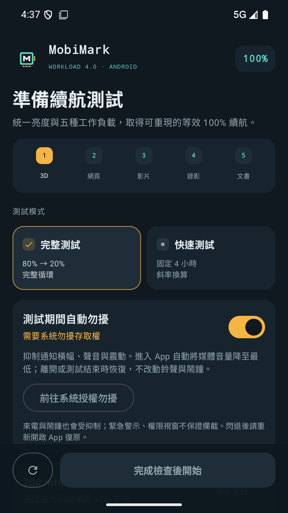
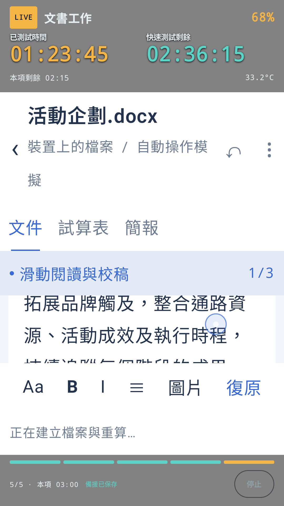
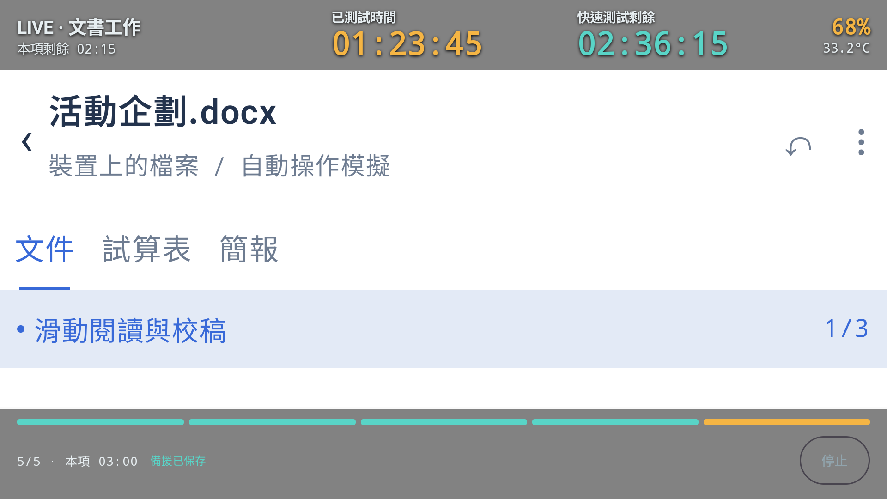
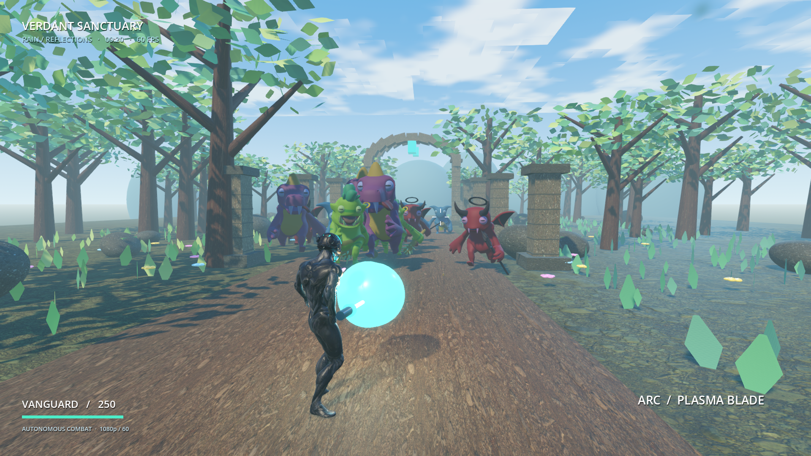

<p align="center"></p>

# MobiMark

**Turn everyday phone workloads into a recorded, repeatable battery-life test.**

[繁體中文（default）](README.md) · English · [Download APK](https://github.com/ahui3c/MobiMark/releases/latest) · [Test protocol](docs/TEST_PROTOCOL.en.md) · [Asset licenses](THIRD_PARTY_ASSETS.md)

MobiMark is an Android battery benchmark by Taiwanese tech creator Ahui (3C 達人廖阿輝). It cycles through gaming, browsing, video, recording and office work, records consumption and reports **equivalent 100% battery runtime**. Formerly Ahuimark, it retains package ID `tw.ahuimark.battery` for installation/data continuity.

> **v0.3.1 is a preview / debug APK**, not a production-signed store release. Estimates are not guaranteed 100%→0% measurements. Scores are not interchangeable with PCMark or BAPCo MobileMark; this independent project is not affiliated with their vendors.

## Install and start

1. Download `MobiMark-v0.3.1-debug.apk` from [Releases](https://github.com/ahui3c/MobiMark/releases/latest), allow installation from the download source and optionally verify `SHA256SUMS.txt`.
2. Android 8.0 / API 26 is the minimum OS, **not a guarantee of hardware compatibility**. Devices must also meet the 3D engine, rear-camera 4K30 and storage requirements.
3. Configure content and grant camera permission and, when automatic DND is enabled, notification-policy access. Browsing and video default to **online** after installation.
4. Calibrate to **200 nits** using the white screen and an external meter, disable adaptive brightness, unplug power and start **above 80%** battery.
5. Unscored preconditioning runs first. At the first sample ≤80%, official timing and workload order reset, restarting with 3D gaming.

Local debug builds may use a different signing key. Do not uninstall or clear data to bypass an update-signature error: export results first.

## Screenshots

Actual software captures, not AI mockups. Home is from the v0.3.0 emulator; timer screenshots show actual v0.2.9 Compose components with **fixed demonstration values, not measured endurance results**. v0.3.1 primarily enlarges the icon artwork; its latest icon appears above.

| Home and modes | Portrait test / office UI |
| --- | --- |
|  |  |

Compact landscape status displays elapsed time and quick-mode time remaining:



Actual rendered Godot development scene, **not the complete v0.3.1 benchmark UI**. Its FPS label is not a measurement or fixed-rate guarantee:



## Five workloads

**3D game → web → video → rear-camera recording → office.** Each lasts 3 minutes; a complete cycle is 15 minutes. Video-call simulation has been removed.

| Workload | Execution |
| --- | --- |
| 3D game | Godot 4.7.2 third-person combat: human soldier, fantasy enemies, rifle/rocket/lightsaber, forest/city/coast and weather. Skeletal animation, materials, shadows, particles and post-processing. Landscape, internal 1920×1080 rendering. |
| Web | Online/offline selection. Up to three editable URLs, at least one required; one-minute rotation, continuous scrolling and reload at the bottom. Offline pages contain extensive text, images and tables. |
| Video | Online playback or a separately downloaded standard local 1080p30 MP4, in landscape. Online quality is service/network/device dependent, not fixed. |
| Camera | CameraX requests rear 3840×2160 at 30 fps with preview and recording UI; no silent 1080p replacement. Actual hardware/output compatibility requires validation. |
| Office | Mobile-style document, spreadsheet and presentation interaction, large text and animated charts. Creates real DOCX/XLSX/PPTX, inserts images, computes specified SUM formulas, compresses and reopens outputs for verification. Not Microsoft Office or a complete Excel engine. |

All workloads request a high-refresh display mode at the current resolution. **Refresh rate is not actual rendered FPS**; it does not interpolate video, and recording still targets 30 fps.

### Default content

- Web: [ahui3c.com](https://ahui3c.com), [Toy People](https://www.toy-people.com/), [LPComment](https://lpcomment.com/).
- Video: [YouTube test video](https://youtu.be/1b-_FC_hIAQ).
- URL rotation: one = A/A/A; two = A/B/A; three = A/B/C, one minute each.
- Local video is **not bundled**. Its downloader validates size and SHA-256; see [asset notices](THIRD_PARTY_ASSETS.md) for provenance/rights.

## Modes and scoring

| Mode | Stop condition | Meaning |
| --- | --- | --- |
| Full | Battery reaches ≤20% after official start | Measures approximately 80%→20%, then extrapolates equivalent 100% runtime. |
| Quick | Four official hours, or ≤20% battery first | Extrapolates from actual elapsed time and consumption, never assumes 60% was consumed. |
| Recovered estimate | Reopen and use the last valid official checkpoint | Both modes; excludes time after the checkpoint and does not resume the run. |

For recorded duration `T` and consumption `D` in percentage points:

```text
Equivalent 100% runtime = T × 100 / D
Equivalent 80%→20% time = T × 60 / D
```

Example: 3 hours consuming 24 points gives 7h30m equivalent 60% time and 12h30m equivalent 100% runtime. Battery behavior is not necessarily linear. **Compare full, quick and recovered scores separately.** Even full mode does not measure 100%→0%. See the [protocol](docs/TEST_PROTOCOL.en.md).

## Records and safeguards

- One-second telemetry; persistent official checkpoint every 30 seconds.
- Automatically stored multi-result history with review, deletion and ZIP export containing PDF, JSON, CSV and event logs; per-workload time and estimated consumption.
- Keeps the screen awake during testing and releases the restriction afterward, without changing the system timeout.
- Lowers media volume on entry, with guarded restoration on exit/completion, respecting intervening user changes.
- Optional automatic Do Not Disturb; removes its rule or restores the previous state afterward. Not kiosk mode; cannot prevent every emergency/system interruption.
- Charging, leaving the foreground and battery temperature ≥48°C can abort a test. Normal stops/safety aborts are not crash recovery.
- Calibration is white-only: **no brightness slider, automatic 200-nit setting or luminance verification**. Use an external meter with system/ADB controls.

## Conditions and comparability

**App checks:** battery >80%, not charging, camera permission, rear 4K30 capability, at least 3 GiB available storage, valid content and DND access when automatic DND is enabled. Resolve pending recovery records first.

**Operator-controlled, not app-enforced:** 200 nits, adaptive brightness off, matching resolution/refresh settings, fixed network/video sources, comparable battery health and ambient temperature. Recommended ambient: 23±2°C; cool down and repeat at least three times, reporting the median. USB/ADB must not keep the device charging.

Web pages, ads, streaming quality, OS and workload versions affect scores. For greater repeatability, use both offline web and identical local video and record all conditions. Do not directly equate results across iOS/Android or unrelated benchmarks.

## Build

Requirements: JDK 17, Android SDK 36 and platform tools. Game export requires **Godot 4.7.2 and matching Android export templates**. Gradle Wrapper is included. Initial builds need internet and sufficient disk space. Models/textures in `godot/` retain their individual licenses.

```powershell
git clone https://github.com/ahui3c/MobiMark.git
cd MobiMark
# Set JAVA_HOME / ANDROID_HOME to your JDK 17 / Android SDK.
.\tools\build-godot.ps1 -Godot 'C:\Tools\Godot\Godot_v4.7.2-stable_win64_console.exe'
.\gradlew.bat assembleDebug testDebugUnitTest lintDebug
```

Alternatively download `prism_front.pck` from the **matching Release** into `app/src/main/assets/` before Gradle. Re-export after changing game code; do not mix versions. Default APK: `app/build/outputs/apk/debug/app-debug.apk`. On other OSes, follow the script's Godot CLI sequence and use `./gradlew`.

Existing v0.3.1 records: debug APK and Android test APK built; 73 unit tests passed; lint 0 errors, 18 warnings. This **does not establish** a four-hour/full discharge test or compatibility with every physical device, YouTube player, camera or GPU.

## License and support

Original code: [Apache-2.0](LICENSE). Godot: MIT. Models/textures: CC BY 4.0 or CC0 with their attribution requirements. See [THIRD_PARTY_ASSETS.md](THIRD_PARTY_ASSETS.md) and [godot/CREDITS.txt](godot/CREDITS.txt). Creators do not endorse this project; no Overwatch assets are included. External websites/videos are not relicensed with the code.

In [Issues](https://github.com/ahui3c/MobiMark/issues), include device, Android/App version, mode, sources and reproduction steps. Check reports for private URLs, device information or imagery before sharing.
